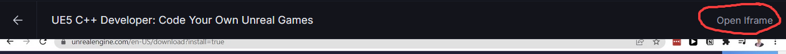

# Addon Translate Browser

Extension pour navigateur _surtout tester sur Firefox pour le moment_ permettant de traduire en français les sous-titres anglais des vidéos du site [GameDev](https://www.gamedev.tv).

## Pour commencer

Avec l'utilisation de [LibreTranslate](https://github.com/LibreTranslate/LibreTranslate) pour la traduction.
De Python pour l'utilisation de LibreTranslate.

### Pré-requis

- [x] Le projet ici-même
- [ ] Votre navigateur _Pour le moment tester uniquement sur Firefox_
- [ ] Python 3.11 [Téléchargeable ici](https://www.python.org/ftp/python/3.11.4/python-3.11.4-amd64.exe)
- [ ] [LibreTranslate](https://github.com/LibreTranslate/LibreTranslate) _Qui se mettra en place via Python_
- [ ] Ajouter ICU_VERSION aux variables d'environnements.

## Installation

### 1. Ajout ICU_Version

Tout d'abord, aller rechercher votre version ICU_Version. Pour cela,

1️⃣ Ouvrir votre explorateur de fichier

2️⃣ Accéder à votre disque système _C: par default_

3️⃣ Suivez ce chemin : Dossier **Windows** ➤ Dossier **System32**

4️⃣ Rechercher le fichier **icu.dll**

5️⃣ Clique droit ➤ **Propriété** ➤ **Détails**

6️⃣ Rechercher la ligne **Version du fichier**

Maintenant, on va l'ajouter aux variables d'environnements.

1️⃣ **Touche Windows + r**

2️⃣ Coller ceci \***\*SystemPropertiesAdvanced\*\***

3️⃣ Cliquer sur **Variables d'environnements** en bas à droite

4️⃣ Faire la manipulation suivante pour les deux sections : **Utilisateur** & **Système**

0️⃣1️⃣ Appuyez sur **Nouveau**

0️⃣2️⃣ Nom Variable : **ICU_VERSION**

0️⃣3️⃣ Valeur Variable : La valeur qui était renseignée dans la ligne **Version du fichier**

0️⃣4️⃣ Appuyez sur **Ok**

5️⃣ Redémarrer votre ordinateur après avoir effectué l'ajout.

### 2. Installation LibreTranslate

1️⃣ Ouvrez votre invite de commande en administrateur.

2️⃣ Conception d'un environnement virtuel

```bash
py -3.11 -m venv NOM_ENV
```

3️⃣ Activer l'environnement

```bash
NOM_ENV\Scripts\activate
```

4️⃣ Installer LibreTranslate

```bash
pip install libretranslate
```

5️⃣ Executer le programme

```bash
libretranslate --load-only en,fr
```

### 3. Installation extension (Firefox)

A partir de l'étape 3, la manipulation sera a reproduire à chaque lancement de Firefox.
En attendant que ceux-ci valident l'extension pour pouvoir l'ajouter sur leur base de données.

1️⃣ Télécharger le fichier zip en haut en cliquant sur **Code** ou en cliquant [ici](https://github.com/Jefflbs/FirefoxTranslateAddon/archive/refs/heads/main.zip)

2️⃣ Extraire le zip ou vous souhaitez

3️⃣ Rentrez cette url dans firefox : **about:debugging#/runtime/this-firefox**

4️⃣ Cliquer sur "**Charger un module complémentaire temporaire**"

5️⃣ Sélectionner le fichier **manifest.json** du zip que vous avez extrait

## Utilisation

Une fois l'installation effectué, se rendre sur votre formation gamedev.tv et cliquer sur le button **Open Iframe**.

Qui se retrouve a droite du titre, comme le montre cette image :


Bien penser a relancer le programme **LibreTranslate** à chaque fois que vous quitter l'invite de commande ou redémarrage du pc.

1️⃣ Ouvrez votre invite de commande en administrateur.

3️⃣ Activer l'environnement

```bash
NOM_ENV\Scripts\activate
```

5️⃣ Executer le programme

```bash
libretranslate --load-only en,fr
```

## License

Ce projet est sous licence MIT.
